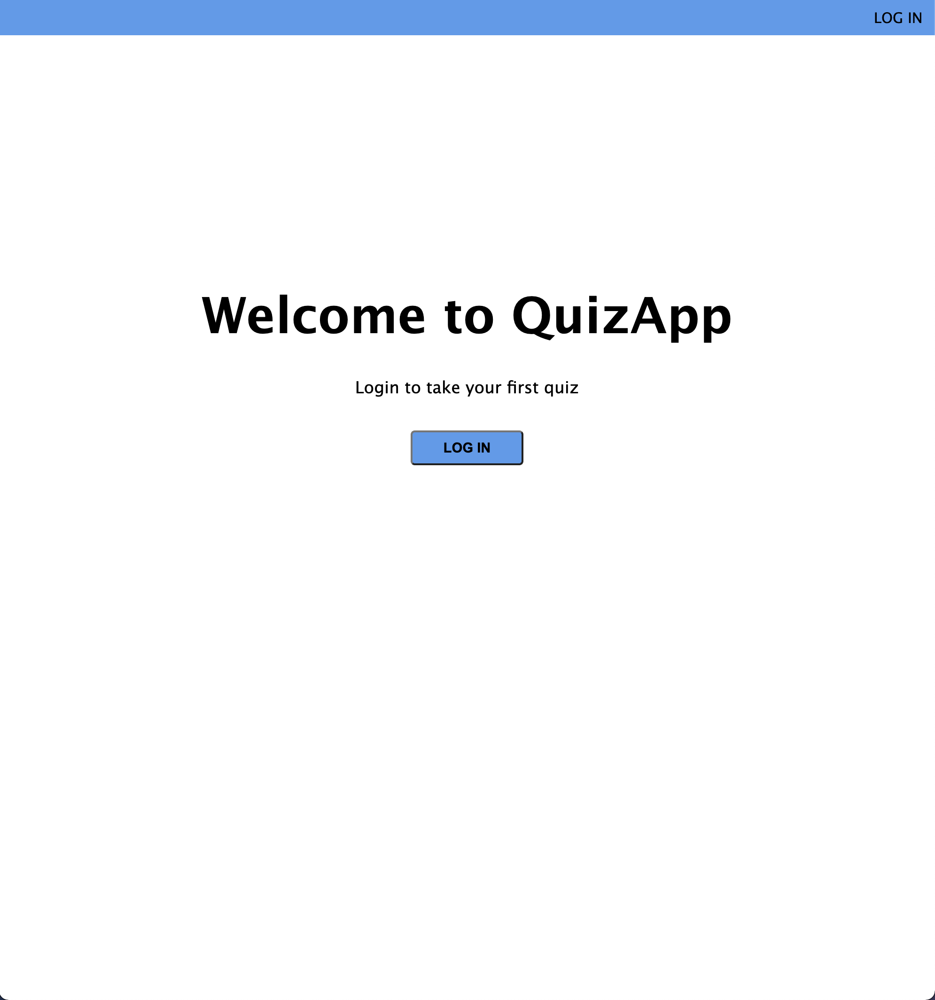
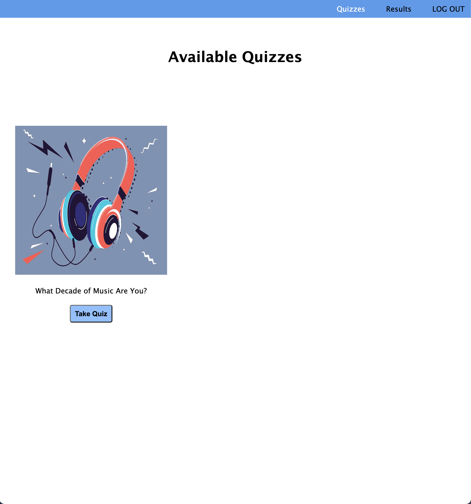
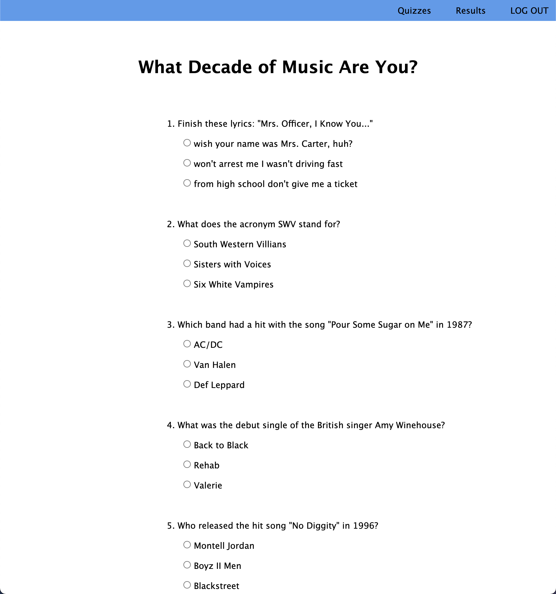
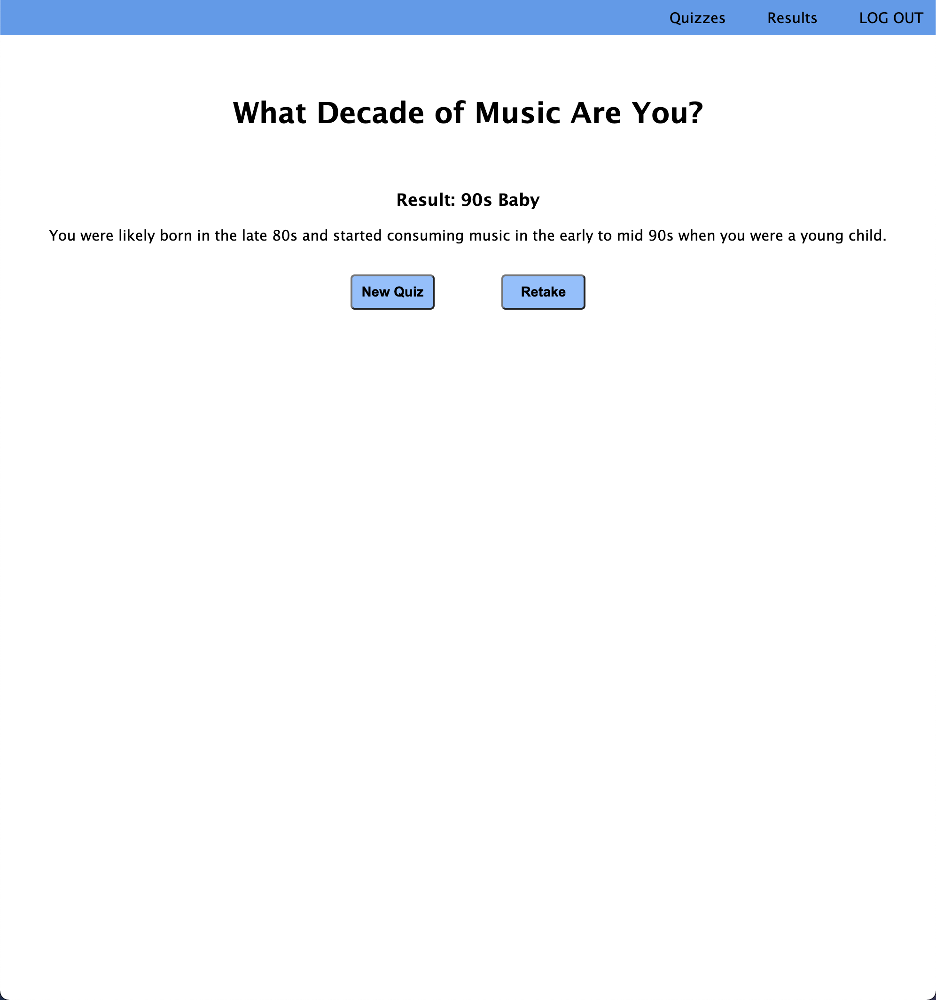
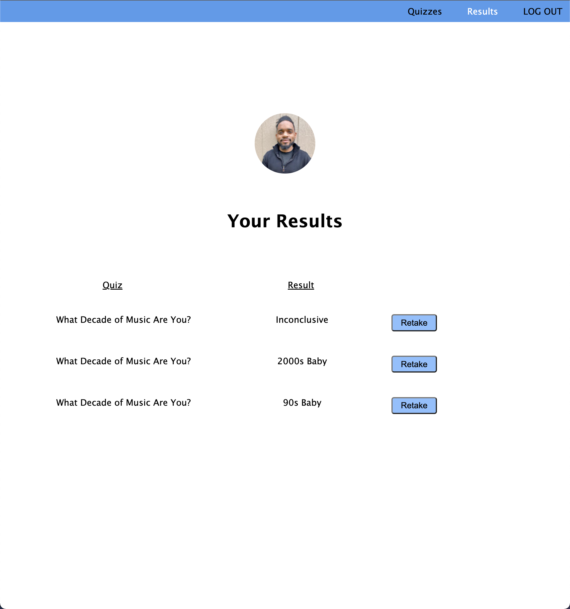

# QuizApp

## Date: 5/26/2023

### By: Jeremy Cox

[LinkedIN](https://www.linkedin.com/in/jeremy-cox-/)
[GitHub](https://www.github.com/remifreyo/QuizApp)
[Trello](https://trello.com/b/1dxn4wYp/quizapp)
[Figma](https://www.figma.com/file/nm9Uh7K3Yc0wK0lPysVU4Q/QuizApp?type=design&node-id=0%3A1&t=q8qg1oRBqpVjwasl-1)

---

### **_Description_**

##### QuizApp is an application that allows the user to choose from a selection of quizzes to take and upon completion provides them with their result.

---

### **_Technologies_**

- HTML
- CSS
- Javascript
- ExpressJS
- NodeJS
- MongoDB
- Mongoose
- EJS

---

### **_Screenshots_**

---

### **_Future Updates_**

- [x] ~~Style the application~~
- [x] ~~Add ability to login with google~~
- [x] ~~Add "What Decade of Music Are You?" Quiz~~
- [x] ~~Build Wireframe~~
- [x] ~~Create ReadMe~~
- [x] ~~Create Trello Board~~
